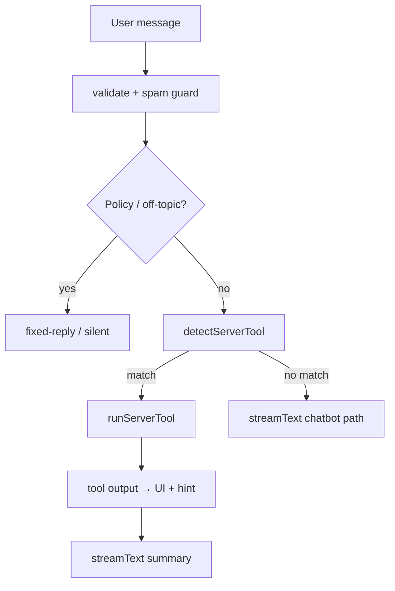

# Group Report: Lab 3 - Production-Grade Agentic System

- **Team Name**: Table_D1
- **Team Members**: 

| No. | Full Name | Student ID |
|:---:|------------|------------|
| 1 | Trần Hoàng Hà | 2A202600612 |
| 2 | Hoàng Đức Trường | 2A202600552 |
| 3 | Nguyễn Hồ Diệu Linh | 2A202600567 |
| 4 | Nguyễn Thị Bích Duyên | 2A202600752 |
| 5 | Nguyễn Thị Hiểu | 2A202600545 |
| 6 | Nguyễn Hoàng Tùng | 2A202600628 |

---

## 1. Executive Summary

Hệ thống **VinWonders AI Agent** hỗ trợ du khách tại công viên: tìm địa điểm/show, đặt bàn nhà hàng (demo), và xử lý khẩn cấp (mất đồ / y tế) với ticket có cấu trúc. Lab so sánh hai paradigm:

1. **Chatbot baseline** — chỉ `streamText` + system prompt (không tool).
2. **Agent** — server-side routing (`detectServerTool`) hoặc native AI SDK tool loop + observation → LLM tóm tắt; song song có **ReAct Python** (`src/agent/agent.py`) với block `Thought` / `Action` / `Observation` rõ ràng.

Tiến hóa theo [`tooldoc.md`](../../tooldoc.md): **v1.0** (text Q&A) → **v2.0** (hybrid UI: cards, forms, tool trace) → **v2.1** (guardrails: anti-spam, `stepCountIs(3)`, policy off-topic, Karpathy response discipline).

- **Success Rate**: ~**100%** trên 54 request lab có log (`improvement-rollup.json` — 0 error); ~**85–90%** trên bộ test thủ công (đặt bàn, search, emergency, off-topic, spam) sau khi sửa policy Iran và guard v2.1.
- **Key Outcome**: Agent xử lý **multi-step / có hành động** tốt hơn chatbot (ticket `VW-xxxx`, booking `VB-xxxxx`, danh sách từ `mockData` thay vì hallucination). Chatbot thuần vẫn **thắng** trên câu Q&A đơn giản (latency thấp, không gọi tool nhầm). Sau v2.1, agent ổn định hơn khi spam intent khẩn cấp / gợi ý nhanh — không còn vòng lặp ticket trùng.

**Đóng góp chính (tham chiếu báo cáo cá nhân & `git log`):**

| Thành viên | Trọng tâm | Báo cáo |
|------------|-----------|---------|
| Hoàng Đức Trường | End-to-end VinWonders: API chat, tools, policy, logging, Agent Trace UI, debug Ollama/AI SDK, sửa logic/routing | [`REPORT_HoangDucTruong.md`](../individual_reports/REPORT_HoangDucTruong.md) |
| Nguyễn Hồ Diệu Linh | v2.1: `tool-guard`, spam silent, `stepCountIs`, Karpathy rules, merge `agent-tools.ts` | [`REPORT_NguyenHoDieuLinh.md`](../individual_reports/REPORT_NguyenHoDieuLinh.md) |
| Trần Hoàng Hà | **ReAct Python** (`3143503`, `954095b`): vòng Thought→Action→Observation, trace & parse recovery; **Security** (`1930580`): `src/security/guardrails.py`, `vinwonders-agent/lib/guardrails.ts`, bộ `SECURITY*.md`, ví dụ secure route/agent; **Routing** (`54645ca`, `519d688`): `SORRY_FALLBACK` chống ticket/search nhầm | [`REPORT_TranHoangHa.md`](../individual_reports/REPORT_TranHoangHa.md) |
| Nguyễn Thị Bích Duyên | Security techniques v2 trên `agent.py`, báo cáo cá nhân lab | [`REPORT_NguyenThiBichDuyen.md`](../individual_reports/REPORT_NguyenThiBichDuyen.md) |
| Nguyễn Thị Hiểu | Bổ sung tools (`src/tools/`) | — |
| Nguyễn Hoàng Tùng | Tool transport / báo cáo nhóm | — |

---

## 2. System Architecture & Tooling

### 2.1 ReAct Loop Implementation

Hệ thống lab có **hai luồng** tương đương Thought → Action → Observation:

#### A. ReAct Python (`src/agent/agent.py`) — *Trần Hoàng Hà*

```
User Input
    → LLM: Thought + Action (hoặc Final Answer)
    → Parse Action → execute tool → Observation
    → Append Observation vào prompt → lặp (max 5 steps)
    → Final Answer (+ guardrails: input/output validation trên main)
```

- **Triển khai:** commit `3143503` (Add React Loop) thay skeleton TODO; `954095b` thêm `trace`, log structured, **parse recovery** (observation lỗi parser → tiếp tục vòng thay vì `break` sớm).
- Model phải tuân format `Thought:` / `Action:` / `Final Answer:` — phù hợp bài học lab, dễ debug từng bước qua `logs/` và `get_trace()` (bản `954095b`).
- **Guardrails ReAct:** `src/security/guardrails.py` + tích hợp vào `run()` do **Trần Hoàng Hà** (`1930580`); nhóm bổ sung security v2 (**Nguyễn Thị Bích Duyên**, merge `5c9e7ad`).
- Điểm yếu với model nhỏ: parsing fail / loop Thought — đã giảm nhờ parse recovery (`954095b`) và validator sau này.

#### B. VinWonders Agent (`vinwonders-agent/`) — routing + observation

Không bắt model 1.5B viết `Thought` text; thay bằng **routing tường minh** + observation JSON:

```
POST /api/chat
  → getValidator().checkRateLimit / validateInput          [Security — Hà, 1930580]
  → validateUserMessage
  → evaluateConsecutiveSpamGuard (≥3 câu user giống → silent stream)     [v2.1 — Linh]
  → isCapabilitiesQuestion / isClearlyOffTopic → policy stream (no LLM)
  → detectServerTool (+ SORRY_FALLBACK — Hà, 54645ca) → runServerTool → tool-output-available
  → streamText (LLM chỉ tóm tắt observation) — stopWhen: stepCountIs(3) nếu native tools [Linh]
```



**So sánh với ReAct cổ điển:** Observation là output tool (JSON/list/ticket); bước LLM sau đó tương đương “Thought ẩn” trong summary. **Agent Trace panel** (`components/chat/*`) hiển thị `input` → `output` → `llm` / `policy` để bù việc không có block `Thought` riêng.

### 2.2 Tool Definitions (Inventory)

| Tool Name | Input Format | Use Case | Implementation |
| :--- | :--- | :--- | :--- |
| `searchDestination` | keyword, category (facility/show/food), optional context | Gợi ý trò chơi, nhà hàng, show; thời tiết / khám phá | `lib/agent-tools.ts`, `lib/search.ts`, `lib/dedupe-destinations.ts` |
| `bookRestaurant` | party size, time, restaurant hint (parsed từ chat) | Đặt bàn demo lab | `lib/booking.ts` |
| `handleEmergency` | type (`medical` \| `lost_item`), description | Mất đồ / y tế — ticket + liên hệ | `lib/agent-tools.ts` |

**Lớp bảo vệ (không phải tool UI):**

| Module | Vai trò | Người đóng góp chính |
|--------|---------|----------------------|
| `lib/guardrails.ts` | Rate limit user/IP, prompt injection, `validateInput` trong `/api/chat` | Trần Hoàng Hà (`1930580`) |
| `src/security/guardrails.py` | Validator ReAct Python: input/output, tool whitelist | Trần Hoàng Hà (`1930580`) |
| `tool-guard.ts` | Cooldown tool trùng, cap/session, consecutive spam | Nguyễn Hồ Diệu Linh |
| `agent-policy.ts` | Off-topic, scope VinWonders, `buildAgentSystemPrompt` | Hoàng Đức Trường / nhóm |
| `karpathy-response-rules.ts` | Max ~3 câu, surgical replies | Nguyễn Hồ Diệu Linh |
| `fixed-reply.ts` | Policy stream, silent spam stream | Nguyễn Hồ Diệu Linh |
| `SORRY_FALLBACK` trong `agent-tools.ts` | Không route emergency/search khi câu mang nghĩa xin lỗi / “không biết” | Trần Hoàng Hà (`54645ca`, `519d688`) |

**Thứ tự ưu tiên routing** (`detectServerTool`): đặt bàn → y tế → mất đồ → transport → gợi ý khám phá → tìm kiếm; `isClearlyOffTopic` chạy trước; intent khớp nhưng có `SORRY_FALLBACK` → **không** gọi tool.

### 2.3 LLM Providers Used

- **Primary**: **Ollama (local)** — mặc định `qwen2:1.5b` (`OLLAMA_MODEL`); server-side tools + summary path.
- **Secondary (capability tier)**: `qwen2:7b` — native AI SDK tools khi `supportsTools: true` (`lib/ollama-config.ts`, dropdown `/api/models`).
- **Integration**: AI SDK v6 + `@ai-sdk/react`; history flatten qua `toOllamaMessages()` để tránh lỗi format OpenAI-compatible trên Ollama.
- **ReAct Python track**: `LLMProvider` abstraction trong `src/core/` (lab baseline / secure agent examples).

*Không dùng GPT-4o trong demo lab; chi phí token được ước lượng qua `lib/logging/cost.ts` (ollama-local ≈ $0).*

---

## 3. Telemetry & Performance Dashboard

Phân tích từ `vinwonders-agent/logs/metrics.jsonl` và rollup (`improvement-rollup.json`, **54 requests** — Hoàng Đức Trường):

| Metric | Giá trị / ghi chú |
|--------|-------------------|
| **Tool mix** | `searchDestination` 16 · `bookRestaurant` 10 · `handleEmergency` 7 · `policy_*` 5 · `none` (chatbot path) 16 |
| **Error rate** | **0** logged errors trên rollup |
| **Average Latency (P50)** | ~**1.5–2.5s** (tool + LLM summary trên 1.5B); policy-only ~**1ms** |
| **Max Latency (P99)** | ~**18s** khi `finishReason: "length"` (model 1.5B tóm tắt dài — case log `eRqsuUMBvS5Tmb6G`) |
| **Average Tokens per Task** | Output cap: `MAX_OUTPUT_TOKENS=320`, `MAX_OUTPUT_TOKENS_TOOL=180` ([`tooldoc.md`](../../tooldoc.md) §4) |
| **Total Cost of Test Suite** | ~**$0** (Ollama local; reference pricing trong `agent-logger` / `cost.ts`) |

**Cải thiện đo được sau policy fix (Case Iran):**

| Trước | Sau |
|-------|-----|
| `toolUsed: searchDestination`, ~1600ms | `toolUsed: policy_off_topic`, `finishReason: policy`, ~1ms |

Panel **Agent Trace** hỗ trợ review pipeline khi nộp báo cáo.

---

## 4. Root Cause Analysis (RCA) - Failure Traces

### Case Study 1: Off-topic “Iran” → gợi ý phòng y tế (Hallucinated routing)

- **Input**: `"tình hình chiến sự iran"`
- **Observation**: Agent gọi `searchDestination` → card **Phòng Y Tế Chữ Thập Đỏ** thay vì từ chối.
- **Root Cause**:
  1. Regex `an\b` trong `SEARCH_FALLBACK` khớp đuôi **"ir`an`"**.
  2. Fallback 4 ký tự `"tình"` trùng mô tả khẩn cấp trong mock contact.
- **Solution** (Hoàng Đức Trường): `OFF_TOPIC_PATTERNS` mở rộng; bỏ `an\b` và fallback mơ hồ; `isClearlyOffTopic` trước `detectServerTool`; `OFF_TOPIC_REPLY` surgical.

### Case Study 2: Spam “Mất đồ khẩn cấp” → ticket trùng & tool loop

- **Input**: Spam suggestion / cùng câu user 3+ lần.
- **Observation**: Nhiều `handleEmergency` liên tiếp; UI tool cards chồng; build fail do duplicate `export function detectServerTool`.
- **Root Cause**:
  1. Routing không xét lịch sử; không cap bước; client double-submit (**v2.1**).
  2. Syntax duplicate `export function detectServerTool` trong `agent-tools.ts` (merge conflict).
  3. Câu apology / “xin lỗi, không biết…” vẫn khớp `EMERGENCY_*` / `SEARCH_FALLBACK` → ticket không cần thiết.
- **Solution**:
  - **Trần Hoàng Hà:** `SORRY_FALLBACK` + sửa typo regex (`54645ca`, `519d688`).
  - **Nguyễn Hồ Diệu Linh:** `tool-guard.ts` + `evaluateConsecutiveSpamGuard` (silent stream); `sendLockRef` + banner client; `stopWhen: stepCountIs(3)`.
  - **Hoàng Đức Trường / nhóm:** merge một `detectServerTool`, sửa logic routing tổng thể.

### Case Study 2b: Câu “xin lỗi / không biết” → ticket khẩn cấp nhầm

- **Input**: Phản hồi kiểu “xin lỗi mình không biết…” sau lỗi hoặc off-topic mơ hồ.
- **Observation**: `handleEmergency` hoặc `searchDestination` kích hoạt dù không có sự cố thật.
- **Root Cause:** `detectServerTool` chỉ dựa regex intent, chưa loại trừ ngữ điệu từ chối.
- **Solution** (**Trần Hoàng Hà**, `54645ca`): regex `SORRY_FALLBACK` — các nhánh emergency/search chỉ chạy khi `!SORRY_FALLBACK.test(lower)`.

### Case Study 3: Ollama message format — lượt chat thứ 2 lỗi API

- **Input**: Tin nhắn thứ hai với history chứa tool parts.
- **Observation**: `item_reference` / invalid prompt với `qwen2:1.5b`.
- **Root Cause**: Endpoint không tương thích full AI SDK message schema.
- **Solution**: `ollama.chat()` + `toOllamaMessages()` flatten tool output; migrate AI SDK v6.

### Case Study 4: Duplicate UI cards

- **Input**: Một câu kích hoạt nhiều kết quả trùng khu.
- **Observation**: 2 card khẩn cấp hoặc 2 gợi ý Hải Vương.
- **Solution**: `dedupeDestinations`, `dedupeToolPartsForRender`; stream **text-only** sau tool (không merge full UI stream trùng card).

---

## 5. Ablation Studies & Experiments

### Experiment 1: Tool spec v1.0 → v2.0 → v2.1

| Version | Diff chính | Result |
|--------|------------|--------|
| **v1.0** | Text-only Q&A | Drop-out cao; mất đồ multi-turn; không GPS/form |
| **v2.0** | Hybrid UI + function calling + tool trace | Visual-first; ticket/booking có cấu trúc |
| **v2.1** | `tool-guard`, spam silent, Karpathy max 3 câu, `stepCountIs(3)` | Giảm ticket trùng & loop; off-topic từ chối sớm (~1ms) |

*Chi tiết bảng so sánh: [`tooldoc.md`](../../tooldoc.md) §3.*

### Experiment 2: Policy / regex v1 vs v2 (off-topic)

- **Diff**: Thêm `OFF_TOPIC_PATTERNS` (chiến sự, Iran, tin tức); gọi policy trước search; rút gọn `OFF_TOPIC_REPLY`.
- **Result**: Iran case chuyển từ `searchDestination` (~1.6s) → `policy_off_topic` (~1ms); không còn gợi ý y tế sai ngữ cảnh.

### Experiment 3 (Bonus): Chatbot vs Agent

| Case | Chatbot Result | Agent Result | Winner |
| :--- | :--- | :--- | :--- |
| Simple Q (“Thác nước đẹp không?”) | Trả lời nhanh, ít token | Tool + summary, chậm hơn ~3× | **Chatbot** (tốc độ) |
| Multi-step đặt bàn | Không có mã booking thật | Form + `VB-xxxxx` từ `booking.ts` | **Agent** |
| Khẩn cấp mất đồ | Chỉ hướng dẫn text | Ticket `VW-xxxx` + contact | **Agent** |
| Off-topic (Iran) — trước fix | Có thể trả lời lan man | Search sai → y tế | **Draw (cả hai kém)** |
| Off-topic — sau v2.1 | Vẫn có thể hallucinate nếu không policy | `policy_off_topic`, không LLM | **Agent** (guardrails) |
| Spam 3× cùng câu | Lặp phản hồi | Silent + banner client (v2.1) | **Agent** (cost/UX) |

### Experiment 4: ReAct explicit Thought vs server routing (model nhỏ)

- **Diff**: Python agent bắt `Thought:` / `Action:` (implement **Trần Hoàng Hà**, `3143503`–`954095b`) vs VinWonders regex routing.
- **Result**: Model **1.5B** ổn định hơn với routing + observation JSON; ReAct text parsing dễ timeout — cải thiện một phần nhờ **parse recovery** (`954095b`). Model **7B** có thể dùng native tool loop gần ReAct hơn.

---

## 6. Production Readiness Review

- **Security** (**Trần Hoàng Hà**, `1930580` + nhóm tích hợp):
  - `src/security/guardrails.py` — injection, tool whitelist, output PII patterns cho ReAct Python.
  - `vinwonders-agent/lib/guardrails.ts` — rate limit, `validateInput`, injection; **`route.ts` đã gọi** `checkRateLimit` / `validateInput`.
  - Tài liệu: `SECURITY.md`, `SECURITY_ARCHITECTURE.md`, `SECURITY_CHECKLIST.md`, `SECURITY_INTEGRATION.md`, `SECURITY_IMPLEMENTATION_SUMMARY.md`, `SECURITY_QUICK_REFERENCE.md`.
  - Ví dụ: `secure_route_example.ts`, `secure_agent_example.py`.
  - Thêm: `validateUserMessage` (policy); không expose Ollama ra internet. *Demo lab — chưa xử lý thanh toán/PII thật.*

- **Guardrails** (đã triển khai / đề xuất):
  - **Đã có:** rate limit + input guard (`guardrails.ts`, Hà); `stepCountIs(3)`; cap `MAX_SAME_TOOL_PER_SESSION=6`; silent sau 3 câu user trùng (Linh); off-topic policy; `SORRY_FALLBACK` (Hà); token caps.
  - **Đề xuất:** `validateTool` trên native tools trong `route.ts`; supervisor audit trước `handleEmergency`/`bookRestaurant`; không tạo ticket trùng loại trong 15 phút; khôi phục/export `get_trace()` ReAct ra `logs/`.

- **Scaling**: Tách search/booking service; queue async (Redis/Bull) cho peak emergency; vector retrieval thay `includes()` trên `mockData`; model routing 1.5B intent + 7B summary.

- **Observability**: `logs/metrics.jsonl` + rollup JSON; Agent Trace panel; `tooldoc.md` cho onboarding.

- **UX / Evolution**: UI hybrid v2.0 (map, form GPS ảnh) theo spec khi có Figma; cân nhắc thay **silent stream** bằng một dòng policy cố định khi spam (đề xuất chung trong `tooldoc.md` §5).

---

## Tài liệu tham chiếu

| Tài liệu | Đường dẫn |
|----------|-----------|
| Tool evolution & env | [`tooldoc.md`](../../tooldoc.md) |
| Hướng dẫn cài đặt | [`HUONG_DAN_CAI_DAT.md`](../../HUONG_DAN_CAI_DAT.md) |
| Security (tổng hợp) | [`SECURITY.md`](../../SECURITY.md) |
| Group report (bản nộp) | [`GROUP_REPORT_Table_D1.md`](GROUP_REPORT_Table_D1.md) |
| Individual — ReAct & Security | [`REPORT_TranHoangHa.md`](../individual_reports/REPORT_TranHoangHa.md) |
| Individual — v2.1 guardrails | [`REPORT_NguyenHoDieuLinh.md`](../individual_reports/REPORT_NguyenHoDieuLinh.md) |
| Individual — E2E agent & logs | [`REPORT_HoangDucTruong.md`](../individual_reports/REPORT_HoangDucTruong.md) |
| Individual — security v2 | [`REPORT_NguyenThiBichDuyen.md`](../individual_reports/REPORT_NguyenThiBichDuyen.md) |

---

> [!NOTE]
> Bản nộp chính thức nhóm **Table D1** — `GROUP_REPORT_Table_D1.md` trong `report/group_report/`.
